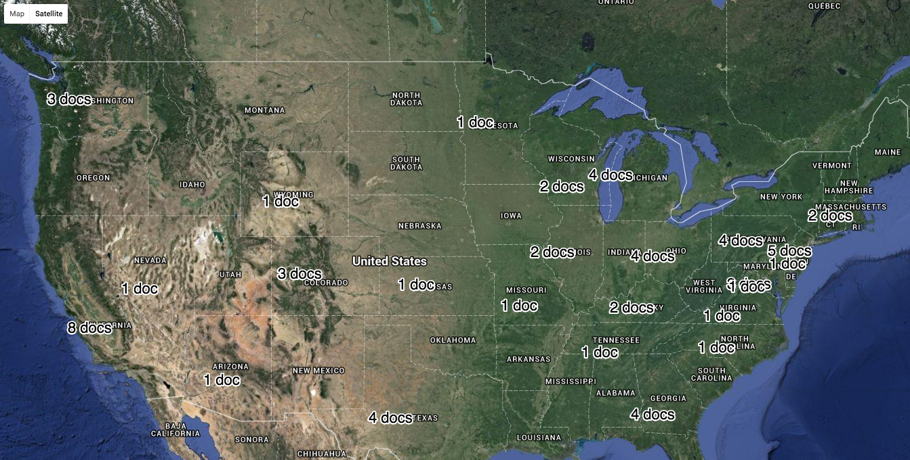
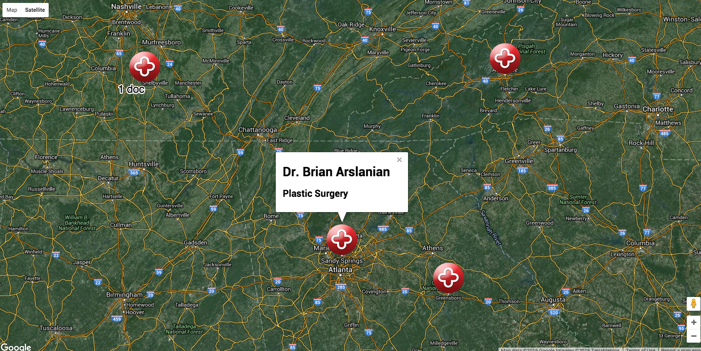

# HealthTap Doctor Network Coverage Application 

## Intro
HealthTap is a platform for people to manage their health. One of the core features of the platform is Telemedicine. A patient can connect with a doctor over text, voice or video from anywhere and anytime. United States laws limit a doctor from seeing a patient from a state different from what they have licenses for. This single law has determined the architecture for the telemedicine feature of HealthTap. To ensure that a patient anywhere in the US can connect with a doctor anytime the Medical Experts team at HealthTap makes sure that every state where we provide service as a doctor online 24/7. We call it Doctor Network Coverage.

## Your Task
You are going to build an app which would allow you to monitor the Doctor Network Coverage for the United States. You will see a map of the United States and the number of doctors available during any given time for a state. You will be able to zoom into to the map to figure out the names of the doctors and the precise location where they are available. 

[](# Zoomed Out View)

[](# Zoomed In View)


As a part of this workshop we are going to learn how to build an application end-to-end. We will launch a basic webserver on your machine and build the backend and the front end for the application. 

To get started pull this starter code. Go to the directory "HealthTap Doctover Network Coverage" and run the following command
```
python -m SimpleHTTPServer 8080
```
This will launch a simple HTTP server on the port 8080. Now open up any webbrowser and go to "http://localhost:8080". If you see a page which says "This Works!" you are all set for the workshop.

There are no pre-requesites for the worshop however it would be useful to read a little bit on RESTful architecture, HTTP, Webserver & API. A basic knowledge of javascript is beneficial but not required. We will be using Google Maps Javascript APIs to build most of the features in this workshop.   
